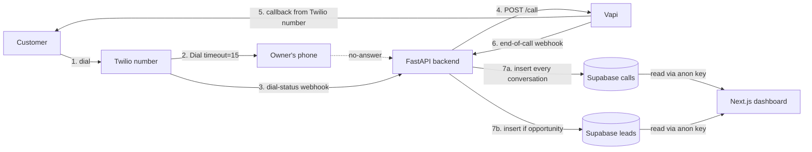

# missed-callback-ai

An AI voice agent that automatically calls back customers whose calls were missed, holds a short conversation, and stores the result in a database for the business owner to review.

Final school project — a focused demo, not a SaaS product.

---

## Live deployment

| Environment | Branch | Backend | Frontend (dashboard) |
|---|---|---|---|
| **production** | `main` | https://backend-production-b7e9.up.railway.app ✅ | https://frontend-production-dbfb.up.railway.app ✅ |
| **staging** | `dev` | https://backend-staging-eb69.up.railway.app ✅ | https://frontend-staging-98c8.up.railway.app ✅ |

Both backends respond to `GET /health` with `{"status":"ok"}`. Both frontends serve `/`, `/calls`, `/leads` with 200. Production env vars are filled in end-to-end (real Twilio number, Vapi assistant, Supabase project, frontend anon key); staging still has placeholders.

### What works today

The system is end-to-end live. A real call into the Twilio number flows through the entire pipeline and lands in the dashboard within seconds of hanging up:

- ✅ **Twilio missed-call detection** — owner-phone dial with 15s timeout, `DialCallStatus` webhook catches no-answer / busy / failed
- ✅ **Vapi outbound callback** — backend triggers the assistant to call the customer back from the same Twilio number (30s delay)
- ✅ **Vapi end-of-call webhook** — backend receives `end-of-call-report`, parses `analysis.summary`, `analysis.structuredData` (name / appointment_requested / preferred_time / call_summary), and the artifact fields
- ✅ **`calls` table** — one row per recovered conversation, **always** inserted: phone, summary, transcript, recording_url, duration_seconds, ended_reason, appointment_requested, preferred_time, status
- ✅ **`leads` table** — one row only when the conversation produced an opportunity (caller asked to book or gave a name): phone, name, summary, appointment_requested, preferred_time, status, missed_call_count
- ✅ **Transcripts saved** — full conversation text from Vapi's artifact, rendered in the dashboard as a chat-style transcript (AI vs. customer bubbles)
- ✅ **Recordings saved** — Vapi's recording URL is stored on the call row and played inline in the dashboard modal
- ✅ **Analytics dashboard (`/`)** — KPI cards with sparklines + week-over-week trend, recovered-calls line chart, leads bar chart, appointment-vs-regular donut, call-status donut, recent calls + recent leads sections
- ✅ **`/calls` page** — full list of every recovered conversation; clicking a row opens a detail modal with summary, duration, preferred time, recording player, conversation-style transcript
- ✅ **`/leads` page** — filtered list of opportunities; clicking a lead opens a detail modal that joins the corresponding `calls` row by phone, so transcript and recording show up on the lead too
- ✅ **Avatar initials from caller name** — when a phone is also a named lead, calls/leads pages render real initials (e.g. `Nathan Attia → NA`); anonymous calls show `?`
- ✅ **RLS configured** — anon key has SELECT-only on `calls` + `leads`; service_role stays backend-only for inserts

The frontend uses the **Supabase anon key only**. The service_role key never leaves the backend.

---

## What it does

1. A customer dials the **business's Twilio number**.
2. Twilio forwards the call to the **owner's private phone** for ~15 seconds.
3. If the owner doesn't pick up (`no-answer` / `busy` / `failed`), the system detects the miss.
4. The backend asks **Vapi** to place an outbound call **from the same Twilio number** back to the customer.
5. A **Vapi voice agent** (STT → LLM → TTS) talks to the customer: answers basic business questions and offers to book an appointment.
6. When the call ends, **Vapi posts an end-of-call report** to the backend.
7. The backend **always inserts a row into `calls`** (every recovered conversation), and **additionally inserts a row into `leads`** only when the conversation produced an opportunity (caller asked for an appointment or gave a name).
8. The **dashboard** reads `calls` and `leads` from Supabase using the anon key and renders the recovered conversation: summary, transcript (as an AI ↔ customer chat), recording player, KPI analytics, and a side-by-side leads view.

---

## Architecture



### Production data flow — end to end

This is what happens when a real call comes in today:

| Step | System | Action | Persisted? |
|---|---|---|---|
| 1 | **Twilio** | Customer dials the business number. Twilio POSTs `/twilio/voice`. | — |
| 2 | **Twilio** | Backend returns TwiML `<Dial timeout="15">` pointing at the owner's phone. | — |
| 3 | **Twilio** | Owner doesn't pick up. Twilio POSTs `/twilio/dial-status` with `DialCallStatus=no-answer`. | — |
| 4 | **Backend** | Counts recent misses for this phone, inserts a `status='missed'` row into `leads` (drives the repeat-caller heuristic), schedules a 30s-delayed Vapi callback as a fire-and-forget task. | ✅ `leads` (status=missed) |
| 5 | **Backend → Vapi** | After 30s, POSTs `/call` to Vapi with the customer's number, the assistant ID, and the Twilio phone-number ID as caller. | — |
| 6 | **Vapi** | Places the outbound call from the same Twilio number. Customer picks up; Vapi agent (STT → LLM → TTS) holds the conversation. | — |
| 7 | **Vapi → Backend** | On hangup, Vapi POSTs `end-of-call-report` to `/vapi/end-of-call` with `x-vapi-secret` header, `analysis.summary`, `analysis.structuredData` (name, appointment_requested, preferred_time, call_summary), `artifact.transcript`, `artifact.recordingUrl`, `durationSeconds`, `endedReason`. | — |
| 8 | **Backend → Supabase** | Always inserts one row into `calls` with every field. Additionally inserts a row into `leads` if `appointment_requested=true` **or** a caller `name` was extracted. Both inserts use the service_role key over PostgREST. | ✅ `calls`, optionally `leads` |
| 9 | **Dashboard** | Next.js page reads `calls` + `leads` from Supabase using the anon key (RLS allows SELECT only). The `/` page aggregates KPIs and charts; `/calls` lists every conversation with a detail modal (summary, duration, recording, transcript); `/leads` joins the matching `calls` row by phone so the same modal renders for opportunities. | — |

End-to-end latency from customer hangup to dashboard row visible: typically under 2 seconds (Vapi posts the report immediately, backend inserts within ~100ms, Supabase replicates within ~1s, the dashboard renders on the next request — pages use `force-dynamic` so a refresh shows the row).

---

## Tech stack

| Layer | Technology |
|---|---|
| Backend | Python 3.11 · FastAPI · httpx |
| Telephony | Twilio Programmable Voice |
| Voice AI | Vapi (STT + LLM + TTS) |
| Database | Supabase (Postgres) |
| Hosting | Railway (Docker, europe-west4) |
| Frontend | Next.js 14 (App Router) + Tailwind + Supabase JS |

---

## Repository layout

```
.
├── backend/                          # deployed to Railway
│   ├── app/
│   │   ├── main.py                   # FastAPI app + /health
│   │   ├── config.py                 # Pydantic settings (env)
│   │   ├── security.py               # Twilio signature verification
│   │   ├── twilio_routes.py          # /twilio/voice  +  /twilio/dial-status
│   │   ├── vapi_client.py            # outbound: trigger Vapi callback
│   │   ├── vapi_routes.py            # /vapi/end-of-call
│   │   └── supabase_client.py        # insert_lead() via PostgREST
│   ├── pyproject.toml
│   ├── Dockerfile
│   ├── railway.json
│   └── .env.example
├── frontend/                         # Next.js 14 dashboard, deployed to Railway
│   ├── app/
│   │   ├── layout.tsx                # sidebar shell
│   │   ├── page.tsx                  # Overview (stat cards + recent calls)
│   │   ├── calls/page.tsx            # Calls table (click row → details modal)
│   │   ├── leads/page.tsx            # Leads table
│   │   ├── loading.tsx               # skeleton
│   │   └── error.tsx                 # error boundary
│   ├── components/                   # StatCard, CallsTable, CallDetailsModal,
│   │                                 # LeadsTable, AudioPlayer, EmptyState,
│   │                                 # StatusBadge, Sidebar, PageHeader, …
│   ├── lib/                          # supabase client, types, queries, format
│   ├── package.json
│   ├── railway.json
│   └── .env.example
└── supabase/                         # managed via Supabase CLI
    ├── config.toml
    └── migrations/
        ├── 20260504123229_create_leads.sql
        ├── 20260505000000_add_missed_call_count.sql
        └── 20260514000000_create_calls.sql
```

---

## Branch & environment strategy

```
main  → Railway production env  → backend-production-b7e9.up.railway.app
dev   → Railway staging env     → backend-staging-eb69.up.railway.app
```

A push to `main` auto-deploys **both** the backend and the frontend to production. A push to `dev` does the same for staging.

---

## API surface

| Method | Path | Purpose |
|---|---|---|
| GET  | `/health` | Liveness probe (Railway) |
| POST | `/twilio/voice` | Inbound voice webhook → returns TwiML `<Dial>` to forward to owner |
| POST | `/twilio/dial-status` | `<Dial>` action callback → triggers Vapi callback if call was missed |
| POST | `/vapi/end-of-call` | Vapi end-of-call report → inserts row into `calls` (always) and into `leads` (if appointment requested or caller named) |

---

## Database schema

Two tables, no auth, no RLS — demo only.

- **`calls`** = **every** recovered callback conversation. One row per Vapi end-of-call report. The dashboard reads from here.
- **`leads`** = the subset of conversations that look like a potential customer / appointment opportunity. Written **only** when the caller asked for an appointment **or** gave their name. Also used by `/twilio/dial-status` to log `status='missed'` rows for repeat-caller tracking.

```sql
create table calls (
  id                    uuid primary key default gen_random_uuid(),
  phone                 text not null,
  call_summary          text,
  transcript            text,
  recording_url         text,
  duration_seconds      int,
  ended_reason          text,
  appointment_requested boolean not null default false,
  preferred_time        text,
  status                text not null default 'completed',
  created_at            timestamptz not null default now()
);

create table leads (
  id                    uuid primary key default gen_random_uuid(),
  phone                 text not null,
  name                  text,
  call_summary          text,
  appointment_requested boolean not null default false,
  preferred_time        text,
  status                text not null default 'new',
  missed_call_count     integer not null default 0,
  created_at            timestamptz not null default now()
);
```

There is no FK between the two — `calls` is a flat log, `leads` is a flat opportunity table. The dashboard can join on `phone` if it ever needs to link a lead back to its conversation. Kept deliberately simple for the MVP.

Project on Supabase: `missed-callback-ai` (ref `gitmyhrstoxjxqawsfbr`).

---

## Setup

### 1. Supabase

```bash
# already done — keeping for reference
supabase login
supabase link --project-ref gitmyhrstoxjxqawsfbr
supabase db push
```

To change the schema later: `supabase migration new <name>` → edit → `supabase db push`.

### 2. Vapi

In the Vapi dashboard:

1. Create an **assistant** with a system prompt for the demo (greeting, basic Q&A, offer to book).
2. Under **Phone Numbers → Import**, register the Twilio number (paste Twilio Account SID + Auth Token). Vapi returns a `phoneNumberId`.
3. On the **assistant** (not the phone number — one place is enough), set:
   - **Server URL** → `<PUBLIC_BASE_URL>/vapi/end-of-call`
   - **Server Messages** → make sure `end-of-call-report` is checked. Without this, no webhook is ever sent.
   - **Server URL Secret** (optional) → if set, also export `VAPI_SERVER_SECRET` with the same value; otherwise leave both empty and the backend skips the header check.
4. Under **Analysis**, enable both `summaryPlan` and `structuredDataPlan`. The new dashboard UI ("Structured Outputs & Scorecard") sometimes saves the fields without actually flipping the plans on — verify via the API (see below). One-shot PATCH that does both:

   ```bash
   curl -X PATCH "https://api.vapi.ai/assistant/$VAPI_ASSISTANT_ID" \
     -H "Authorization: Bearer $VAPI_API_KEY" \
     -H "Content-Type: application/json" \
     -d '{
       "analysisPlan": {
         "summaryPlan": { "enabled": true },
         "structuredDataPlan": {
           "enabled": true,
           "schema": {
             "type": "object",
             "properties": {
               "name":                  { "type": "string",  "description": "Caller first name if mentioned." },
               "appointment_requested": { "type": "boolean", "description": "True if the caller asked to book." },
               "preferred_time":        { "type": "string",  "description": "Caller preferred time, free text." },
               "call_summary":          { "type": "string",  "description": "One-sentence summary of the call." }
             }
           }
         }
       }
     }'
   ```

   Verify it stuck:

   ```bash
   curl -s -H "Authorization: Bearer $VAPI_API_KEY" \
     "https://api.vapi.ai/assistant/$VAPI_ASSISTANT_ID" \
     | jq '{server, analysisPlan}'
   ```

   Both `summaryPlan.enabled` and `structuredDataPlan.enabled` must be `true`. If they aren't, the backend will keep receiving `end-of-call-report` events with empty `analysis` and only `phone` will be saved.

### 3. Twilio

In the Twilio console:

1. Buy or use an existing phone number.
2. Under **Voice & Fax → A CALL COMES IN**, set the webhook to:
   - `https://backend-production-b7e9.up.railway.app/twilio/voice` (POST) — for production
   - or the staging URL while testing

### 4. Local backend (optional, for development)

```bash
cd backend
cp .env.example .env
# fill in all values — see the table below
python3 -m venv .venv && source .venv/bin/activate
pip install fastapi 'uvicorn[standard]' twilio httpx pydantic 'pydantic-settings' python-multipart
uvicorn app.main:app --reload --port 8000
```

For local end-to-end testing, expose port 8000 with ngrok and use the ngrok URL as `PUBLIC_BASE_URL` and as the Twilio webhook host.

---

## Environment variables

| Name | Source |
|---|---|
| `TWILIO_ACCOUNT_SID` | Twilio Console → Account Info |
| `TWILIO_AUTH_TOKEN` | Twilio Console → Account Info |
| `TWILIO_PHONE_NUMBER` | Your Twilio number, E.164 (`+1...`) |
| `OWNER_PRIVATE_PHONE` | Your real phone, E.164 (`+972...`) |
| `VAPI_API_KEY` | Vapi dashboard → Org Settings → Private Key |
| `VAPI_ASSISTANT_ID` | Vapi dashboard → Assistant ID |
| `VAPI_PHONE_NUMBER_ID` | Vapi dashboard → Phone Numbers ID |
| `VAPI_SERVER_SECRET` | Random string, must match the assistant's Server URL Secret |
| `SUPABASE_URL` | `https://gitmyhrstoxjxqawsfbr.supabase.co` |
| `SUPABASE_SERVICE_ROLE_KEY` | Supabase → Settings → API → `service_role` (backend only) |
| `PUBLIC_BASE_URL` | Public URL of this service (Railway URL or ngrok URL) |

`.env` is gitignored — never commit it.

To set a variable on Railway via CLI:

```bash
railway variables --service backend --environment staging --set "TWILIO_ACCOUNT_SID=AC..."
```

---

## Railway infrastructure

The Railway project is `missed-callback-ai`, organised as:

```
Project: missed-callback-ai
├── Environment: production
│   ├── backend   (root=backend,  branch=main, Dockerfile build)
│   └── frontend  (root=frontend, branch=main, Nixpacks build)
└── Environment: staging
    ├── backend   (root=backend,  branch=dev,  Dockerfile build)
    └── frontend  (root=frontend, branch=dev,  Nixpacks build)
```

Both backend services share a single project-level `backend` service, deployed from different branches per environment. Same for `frontend`.

Health check `/health`, restart policy `ON_FAILURE` (max 5).

### `railway.json` start-command gotcha

Railway runs `startCommand` directly without a shell, so unquoted `$VAR` is not expanded. Wrap in `sh -c` if you rely on env-var interpolation in the command itself:

```json
"startCommand": "sh -c 'uvicorn app.main:app --host 0.0.0.0 --port ${PORT:-8000}'"
```

---

## Demo flow (verify locally)

1. `uvicorn app.main:app --reload --port 8000`
2. `ngrok http 8000`, paste the HTTPS URL as `PUBLIC_BASE_URL` and into the Twilio number's voice webhook.
3. Call the Twilio number from a third phone, **don't pick up** your private phone for 15s.
4. The third phone gets called back from the Twilio number — the Vapi agent answers.
5. Have a short conversation, hang up.
6. Open the Supabase **Table Editor**:
   - **`calls`** — a new row appears for **every** conversation, with summary, transcript, recording_url, duration_seconds, ended_reason.
   - **`leads`** — a row appears **only** if you asked for an appointment or gave your name during the call.

### Quick webhook test (without burning Vapi minutes)

```bash
curl -X POST https://backend-staging-eb69.up.railway.app/vapi/end-of-call \
  -H "Content-Type: application/json" \
  -H "x-vapi-secret: $VAPI_SERVER_SECRET" \
  -d '{
    "message": {
      "type": "end-of-call-report",
      "customer": { "number": "+972501234567" },
      "analysis": {
        "summary": "Customer asked about haircut prices and wants to book.",
        "structuredData": {
          "name": "Dana",
          "appointment_requested": true,
          "preferred_time": "tomorrow at 15:00"
        }
      }
    }
  }'
```

A new row should appear in `calls`, and — because the payload above has `appointment_requested: true` and a `name` — a matching row also in `leads`. Drop those fields from the payload to verify the "calls-only" path: only `calls` should grow.

---

## Troubleshooting: end-of-call rows only have `phone`

After a call, a row should always appear in `calls`. A row in `leads` only appears if the caller asked for an appointment or gave a name — if you expected a `leads` row and don't see one, that's the most likely reason. If a `calls` row is inserted but `call_summary`, `transcript`, `recording_url`, `appointment_requested`, `preferred_time` etc. are all NULL, work through these checks in order:

1. **Is `/vapi/end-of-call` being hit at all?** `railway logs -e production` and look for `app.vapi_routes` lines. If you only see `app.twilio_routes` and `app.vapi_client` (outbound), Vapi is not posting back → the assistant has no Server URL or no `serverMessages` subscribed.
2. **Is the event type `end-of-call-report`?** Other types (`speech-update`, `conversation-update`, `status-update`) are received during the call and are ignored by the handler. Only `end-of-call-report` writes a row.
3. **Does Vapi's call object have an analysis?**
   ```bash
   curl -s -H "Authorization: Bearer $VAPI_API_KEY" "https://api.vapi.ai/call/<call_id>" \
     | jq '{status, endedReason, hasAnalysis: (.analysis != null), summary: .analysis.summary, structuredData: .analysis.structuredData}'
   ```
   If `hasAnalysis: false`, the assistant's `analysisPlan` is disabled — re-run the PATCH in section 2.4 above.
4. **Backend defensive parsing.** `vapi_routes.py` accepts several common naming variants for structured-data keys (`name` / `customerName`, `appointment_requested` / `appointmentRequested`, `preferred_time` / `preferredTime`), and synthesizes a short fallback `call_summary` if Vapi didn't return one — so the column is never NULL after the webhook fires successfully.

---

## Status

- [x] Backend skeleton (FastAPI, Twilio + Vapi + Supabase wiring)
- [x] Twilio missed-call detection
- [x] Vapi outbound callback trigger
- [x] Vapi end-of-call → Supabase insert (with defensive parsing + fallback summary)
- [x] Split storage: `calls` (every conversation) + `leads` (opportunities only)
- [x] Supabase migration applied to remote project
- [x] Supabase RLS configured — anon SELECT on `calls` + `leads`, writes locked to service_role
- [x] Railway project + environments (production, staging)
- [x] Backend deployed to both environments with public URLs
- [x] Frontend deployed to both environments with public URLs
- [x] `main` → production, `dev` → staging auto-deploy wired up for both services
- [x] Real env vars filled in (production) — Twilio, Vapi, Supabase service_role (backend) + anon (frontend)
- [x] Twilio webhook + Vapi server URL pointed at production backend
- [x] End-to-end live call test (Server URL, Server Messages, analysisPlan all verified via API)
- [x] Real Vapi call data flowing into Supabase — `calls` and `leads` populated with summary, transcript, recording_url, duration, ended_reason, preferred_time, appointment_requested, name
- [x] Dashboard rendering live data — analytics, /calls, /leads, detail modal, conversation-style transcript, recording player, joined lead↔call by phone

---

## Frontend dashboard

The dashboard lives in `frontend/` and is a Next.js 14 App Router app. It reads `calls` and `leads` directly from Supabase using the **anon** key (no auth, demo only). Server components fetch on every request (`force-dynamic`) — refresh after a call and the new row is there.

### Pages

| Path | Shows |
|---|---|
| `/` | Overview — 4 KPI cards with sparkline + week-over-week trend (recovered calls, leads found, appointments requested, avg duration), recovered-calls line chart (14d), leads bar chart (14d), appointment-vs-regular donut, call-status donut, recent calls (5), recent leads (5), quick-actions row |
| `/calls` | Full table of every callback conversation: caller, summary, duration, status, when. Avatar shows real initials when the phone is also a known lead, otherwise `?`. Clicking a row opens the **call detail modal** (see below). |
| `/leads` | Filtered table of opportunities (caller named or asked to book). Clicking a row opens the **lead detail modal**, which joins the latest matching `calls` row by phone so transcript + recording show up on the lead too. |

### Detail modal

Same component shell on both `/calls` and `/leads`. Features:

- Animated open/close (180ms enter, 150ms exit, scale + fade)
- ~220ms skeleton placeholder before content fades in
- Header with avatar (initials or `?`), caller name or phone, created_at
- Status badges (appointment / completed / missed / lead status)
- Summary, duration, preferred time
- Inline recording player (HTML5 `<audio controls>`) — falls back to "Not available yet" if `recording_url` is null
- **Conversation-style transcript** — Vapi's raw transcript is parsed into AI ↔ customer turns and rendered as alternating chat bubbles (AI = white card with indigo chip; customer = filled indigo bubble labeled with the caller's first name, or "Customer" if anonymous). If the transcript doesn't follow a speaker-prefix pattern it falls back to a plain preformatted block.

If `transcript` or `recording_url` is null the UI shows "Not available yet" instead of breaking. If Supabase env vars are missing, the page shows a friendly banner rather than crashing.

### Local development

```bash
cd frontend
cp .env.example .env.local
# fill in NEXT_PUBLIC_SUPABASE_URL + NEXT_PUBLIC_SUPABASE_ANON_KEY
npm install
npm run dev      # http://localhost:3000
```

### Frontend env vars

| Name | Source | Notes |
|---|---|---|
| `NEXT_PUBLIC_SUPABASE_URL` | Supabase → Settings → API → Project URL | Safe in browser |
| `NEXT_PUBLIC_SUPABASE_ANON_KEY` | Supabase → Settings → API → `anon public` | Safe in browser. **Never** put `service_role` here |
| `NEXT_PUBLIC_APP_ENV` | `production` or `staging` | Optional, shown in the sidebar |

### Deploying the frontend on Railway

The Railway service config lives in `frontend/railway.json` (Nixpacks build, `npm install && npm run build`, start with `npm run start`). For each environment:

1. **Root directory** must be `frontend` (Service → Settings → Source → Root Directory).
2. **Branch** must be `main` for production and `dev` for staging (Service → Settings → Source → Branch).
3. **Environment variables** — set on the frontend service in both environments:
   - `NEXT_PUBLIC_SUPABASE_URL`
   - `NEXT_PUBLIC_SUPABASE_ANON_KEY`
   - `NEXT_PUBLIC_APP_ENV` (optional, `production` or `staging`)
4. Railway automatically provides `PORT`; the frontend reads it via `next start -p ${PORT:-3000}`.

The backend service config in `backend/railway.json` is **untouched** — backend continues to deploy from `backend/` with the Dockerfile.
