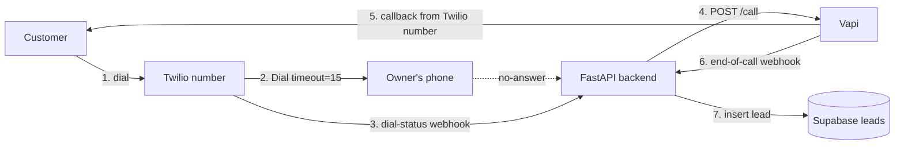

# missed-callback-ai

An AI voice agent that automatically calls back customers whose calls were missed, holds a short conversation, and stores the result in a database for the business owner to review.

Final school project — a focused demo, not a SaaS product.

---

## What it does

1. A customer dials the **business's Twilio number**.
2. Twilio forwards the call to the **owner's private phone** for ~15 seconds.
3. If the owner doesn't pick up (`no-answer` / `busy` / `failed`), the system detects the miss.
4. The backend asks **Vapi** to place an outbound call **from the same Twilio number** back to the customer.
5. A **Vapi voice agent** (STT → LLM → TTS) talks to the customer: answers basic business questions and offers to book an appointment.
6. When the call ends, **Vapi posts an end-of-call report** to the backend.
7. The backend extracts the summary + structured data and **inserts a row into Supabase** (`leads` table).
8. (Future) A dashboard reads the table so the owner sees every recovered call.

---

## Architecture



---

## Tech stack

| Layer | Technology |
|---|---|
| Backend | Python 3.11 · FastAPI · httpx |
| Telephony | Twilio Programmable Voice |
| Voice AI | Vapi (STT + LLM + TTS) |
| Database | Supabase (Postgres) |
| Deployment | Railway (backend) |

---

## Repository layout

```
.
├── backend/
│   ├── app/
│   │   ├── main.py             # FastAPI app + /health
│   │   ├── config.py           # Pydantic settings (env)
│   │   ├── security.py         # Twilio signature verification
│   │   ├── twilio_routes.py    # /twilio/voice  +  /twilio/dial-status
│   │   ├── vapi_client.py      # Outbound: trigger Vapi callback
│   │   ├── vapi_routes.py      # /vapi/end-of-call
│   │   └── supabase_client.py  # insert_lead() via PostgREST
│   ├── pyproject.toml
│   ├── Dockerfile
│   ├── railway.json
│   └── .env.example
└── supabase/
    ├── config.toml
    └── migrations/
        └── 20260504123229_create_leads.sql
```

---

## API surface

| Method | Path | Purpose |
|---|---|---|
| GET  | `/health` | Liveness probe (Railway) |
| POST | `/twilio/voice` | Inbound voice webhook → returns TwiML `<Dial>` to forward to owner |
| POST | `/twilio/dial-status` | `<Dial>` action callback → triggers Vapi callback if call was missed |
| POST | `/vapi/end-of-call` | Vapi end-of-call report → inserts row into `leads` |

---

## Database schema

Single table, no auth, no RLS — demo only.

```sql
create table leads (
  id                    uuid primary key default gen_random_uuid(),
  phone                 text not null,
  name                  text,
  call_summary          text,
  appointment_requested boolean not null default false,
  preferred_time        text,
  status                text not null default 'new',
  created_at            timestamptz not null default now()
);
```

---

## Setup

### 1. Supabase

```bash
# already done — keeping for reference
supabase login
supabase link --project-ref <your-project-ref>
supabase db push
```

To change the schema later: `supabase migration new <name>` → edit → `supabase db push`.

### 2. Vapi

In the Vapi dashboard:

1. Create an **assistant** with a system prompt for the demo (greeting, basic Q&A, offer to book).
2. Under **Phone Numbers → Import**, register the Twilio number (paste Twilio Account SID + Auth Token). Vapi returns a `phoneNumberId`.
3. Under **Server URL** on the assistant:
   - URL: `<PUBLIC_BASE_URL>/vapi/end-of-call`
   - Secret: any random value — also set as `VAPI_SERVER_SECRET` in `.env`.
4. Under **Analysis → Structured Data**, configure:
   ```json
   {
     "type": "object",
     "properties": {
       "name":                  { "type": "string",  "description": "Customer's name if mentioned" },
       "appointment_requested": { "type": "boolean", "description": "Did the customer ask to book?" },
       "preferred_time":        { "type": "string",  "description": "Free-text preferred time" }
     }
   }
   ```

### 3. Twilio

In the Twilio console:

1. Buy or use an existing phone number.
2. Under **Voice & Fax → A CALL COMES IN**, set the webhook to:
   - `https://<your-host>/twilio/voice` (POST)

### 4. Backend

```bash
cd backend
cp .env.example .env
# fill in all values — see the table below
python3 -m venv .venv && source .venv/bin/activate
pip install fastapi 'uvicorn[standard]' twilio httpx pydantic 'pydantic-settings' python-multipart
uvicorn app.main:app --reload --port 8000
```

For local end-to-end testing, expose port 8000 with ngrok and use the ngrok URL as `PUBLIC_BASE_URL` and as the Twilio webhook host.

---

## Environment variables

| Name | Source |
|---|---|
| `TWILIO_ACCOUNT_SID` | Twilio Console → Account Info |
| `TWILIO_AUTH_TOKEN` | Twilio Console → Account Info |
| `TWILIO_PHONE_NUMBER` | Your Twilio number, E.164 (`+1...`) |
| `OWNER_PRIVATE_PHONE` | Your real phone, E.164 (`+972...`) |
| `VAPI_API_KEY` | Vapi dashboard → Org Settings → Private Key |
| `VAPI_ASSISTANT_ID` | Vapi dashboard → Assistant ID |
| `VAPI_PHONE_NUMBER_ID` | Vapi dashboard → Phone Numbers ID |
| `VAPI_SERVER_SECRET` | Random string, must match the assistant's Server URL Secret |
| `SUPABASE_URL` | Supabase → Settings → API → Project URL |
| `SUPABASE_SERVICE_ROLE_KEY` | Supabase → Settings → API → `service_role` (backend only) |
| `PUBLIC_BASE_URL` | Public URL of this service (Railway URL or ngrok URL) |

`.env` is gitignored — never commit it.

---

## Demo flow (verify locally)

1. `uvicorn app.main:app --reload --port 8000`
2. `ngrok http 8000`, paste the HTTPS URL as `PUBLIC_BASE_URL` and into the Twilio number's voice webhook.
3. Call the Twilio number from a third phone, **don't pick up** your private phone for 15s.
4. The third phone gets called back from the Twilio number — the Vapi agent answers.
5. Have a short conversation, hang up.
6. Open the Supabase **Table Editor → `leads`** — a new row appears with the summary + extracted fields.

### Quick webhook test (without burning Vapi minutes)

```bash
curl -X POST http://localhost:8000/vapi/end-of-call \
  -H "Content-Type: application/json" \
  -H "x-vapi-secret: $VAPI_SERVER_SECRET" \
  -d '{
    "message": {
      "type": "end-of-call-report",
      "customer": { "number": "+972501234567" },
      "analysis": {
        "summary": "Customer asked about haircut prices and wants to book.",
        "structuredData": {
          "name": "Dana",
          "appointment_requested": true,
          "preferred_time": "tomorrow at 15:00"
        }
      }
    }
  }'
```

A new row should appear in `leads`.

---

## Deployment (Railway)

- **Root directory:** `backend/`
- **Builder:** Dockerfile (already configured in `railway.json`)
- **Healthcheck:** `/health`
- Set every variable from the table above in Railway's environment settings.
- After the first deploy, copy the Railway public URL into:
  - `PUBLIC_BASE_URL` (Railway env)
  - The Twilio number's voice webhook
  - The Vapi assistant's Server URL

---

## Status

- [x] Backend skeleton (FastAPI, Twilio + Vapi + Supabase wiring)
- [x] Twilio missed-call detection
- [x] Vapi outbound callback trigger
- [x] Vapi end-of-call → Supabase insert
- [x] Supabase migration applied to remote project
- [ ] End-to-end live test
- [ ] Dashboard (Next.js) reading `leads`
- [ ] Railway deploy
